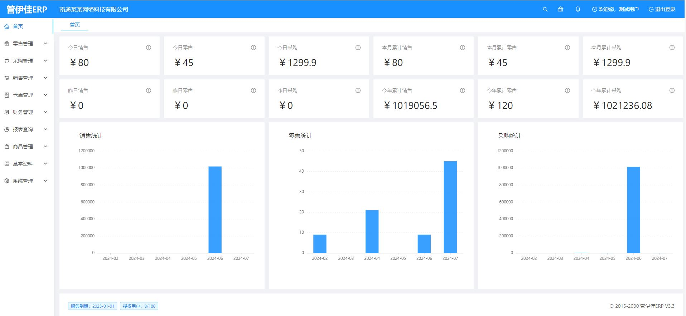
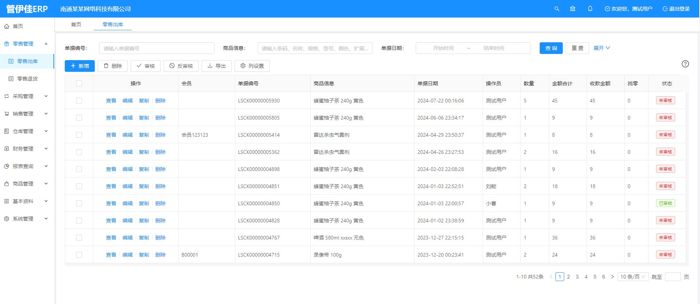
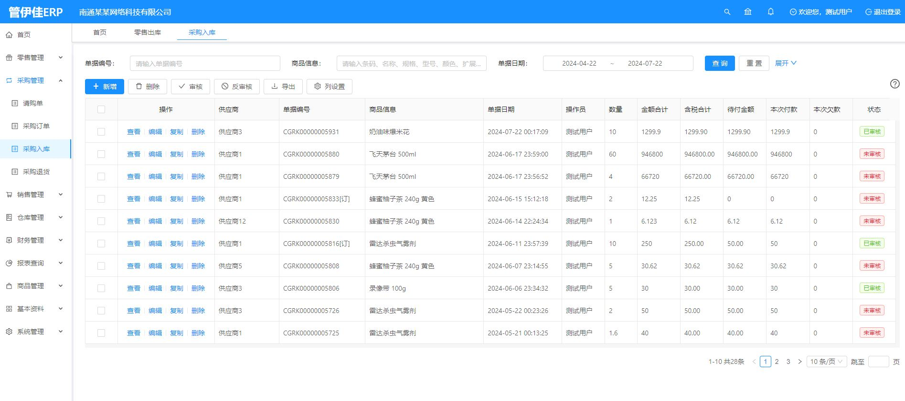
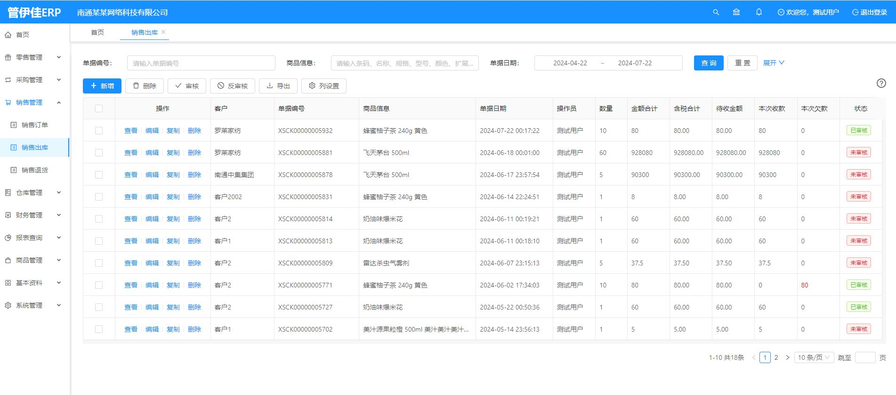
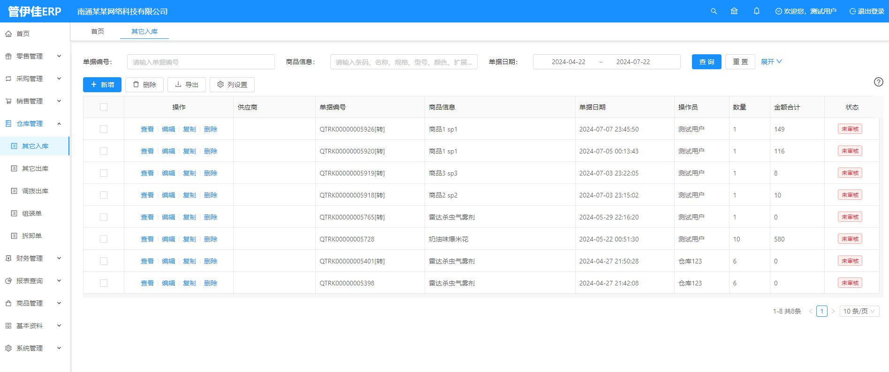
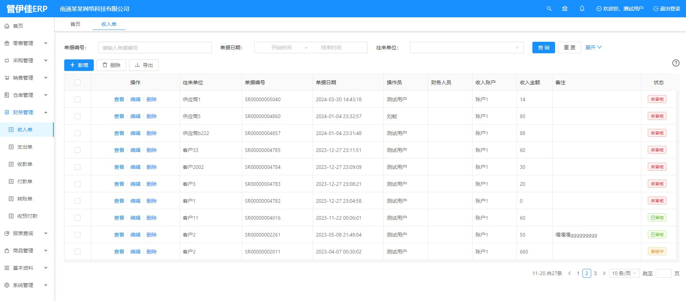
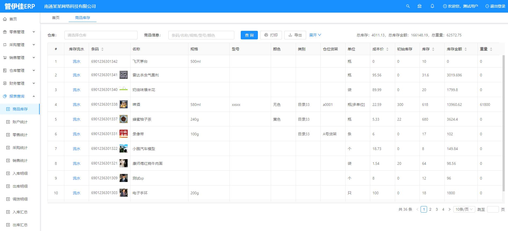
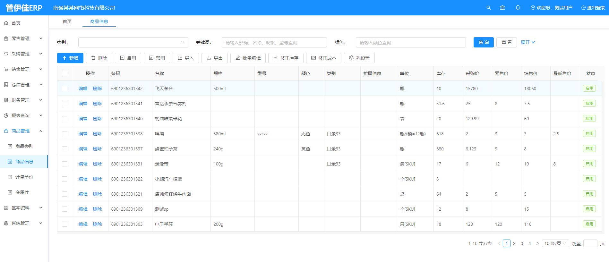
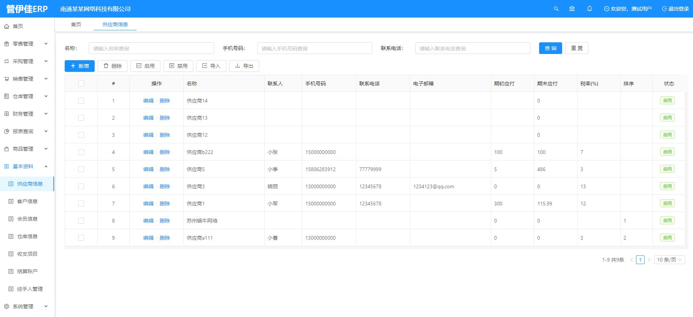
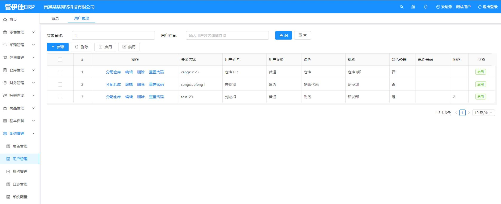

# 项目总述
* 很多人说管伊佳ERP（原名：华夏ERP，英文名：jshERP）是目前人气领先的国产ERP系统
* 虽然目前只有进销存+财务+生产的功能，但后面将会推出ERP的全部功能，有兴趣请帮点一下 **Star** 哦
* **官网地址：http://www.gyjerp.com  商务或技术交流，请联系QQ：752718920 微信：shenhua861584**
* 对物联网感兴趣的朋友欢迎关注我们的新开源系统：[管伊佳物联](https://gitee.com/jishenghua/gyj-iot)

# 网络版介绍
* 推荐使用网络版（198元1年）淘宝链接：https://item.taobao.com/item.htm?id=674169489573
* 平台地址：http://cloud.gyjerp.com 欢迎大家注册租户进行使用
* 网络版手机端请扫描下方二维码

# 定制和插件
* 如有ERP私人定制需求，请将需求整理成文档，发给邮箱： **752718920@qq.com** ，我会及时回复哒
* 如需更多功能，欢迎购买作者小店的插件 https://shop104070207.taobao.com/ 谢谢支持

# 开发初衷
* 管伊佳ERP立志为中小企业提供开源好用的ERP软件，降低企业的信息化成本
* 个人开发者也可以使用管伊佳ERP进行二次开发，加快完成开发任务
* 初学JAVA的小伙伴可以下载源代码来进行学习交流

# 技术框架
* 核心框架：SpringBoot 2.0.0
* 持久层框架：Mybatis 1.3.2
* 日志管理：SLF4J 1.7
* 前端框架：Vue 2.7.16
* UI框架: Ant-Design-Vue 1.5.2
* 模板框架: Jeecg-Boot 2.2.0
* 项目管理框架: Maven 3.2.3

# 开发环境
建议开发者使用以下环境，可以避免版本带来的问题
* IDE: IntelliJ IDEA 2019.2+和JetBrains WebStorm 2019.3+
* DB: Mysql 8.0.24
* JDK: JDK 1.8
* Node: Node 20.17.0
* Maven: Maven 3.2.3+
* Redis: 6.2.1
* Nginx: 1.12.2 

# 服务器环境
* 数据库：Mysql8.0.24
* JAVA平台：JRE1.8
* Redis库：redis6.2.1
* Nginx代理：nginx1.12.2
* 操作系统：Windows、Linux等

# 配套资料
* 需要用户手册请访问这里 https://www.gyjerp.com/doc/archive/user-manual.html
* 需要接口文档请查看这里 https://www.gyjerp.com/doc/archive/apidoc.html
* 喜欢视频教程可以看这里 https://space.bilibili.com/540003552/channel/series 
* 为方便大家搭建运行环境，分享了下载地址 https://pan.baidu.com/s/1jlild9uyGdQ7H2yaMx76zw  提取码:814g
* 不会打包的小伙伴，请下载此打包后的文件 https://share.weiyun.com/NDJNLhry 密码：vd3aig
* 不会部署的小伙伴，请参考部署教程 https://www.gyjerp.com/doc/archive/deploy.html
* 部署后登录系统的默认租户账号：jsh，默认超管账户：admin，默认密码均为：123456

# 开源说明
* 本系统100%开源，遵守Apache-2.0协议，企业可以商用
* 支持全球73种语言，在登录后右上角“界面设置”页面进行切换

# 系统美图
* 首页

* 零售管理

* 采购管理

* 销售管理

* 仓库管理

* 财务管理

* 报表查询

* 商品管理

* 基本资料

* 系统管理

# 如何支持
* 开源不易，坚持更难！如果您觉得管伊佳ERP不错，不用请作者喝咖啡。
* 您可以将我们的云平台地址：https://cloud.gyjerp.com 发给您的家人或朋友，只要是开店的、办厂的、做批发的都可以用得上。
* 您可以到我们自营的拼多多商城进行支持：https://mobile.pinduoduo.com/mall_page.html?mall_id=375313371
* 以上将是对我们开源最大的支持！在此表示感谢！